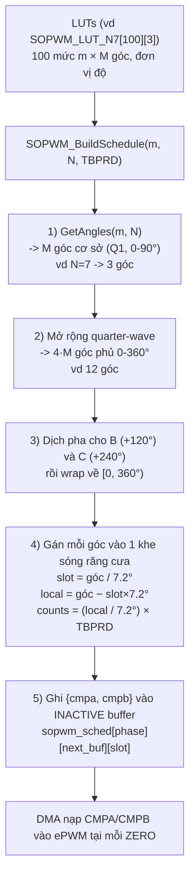
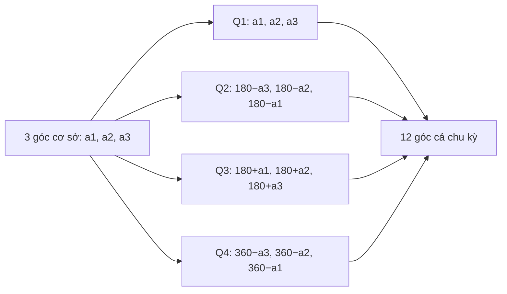
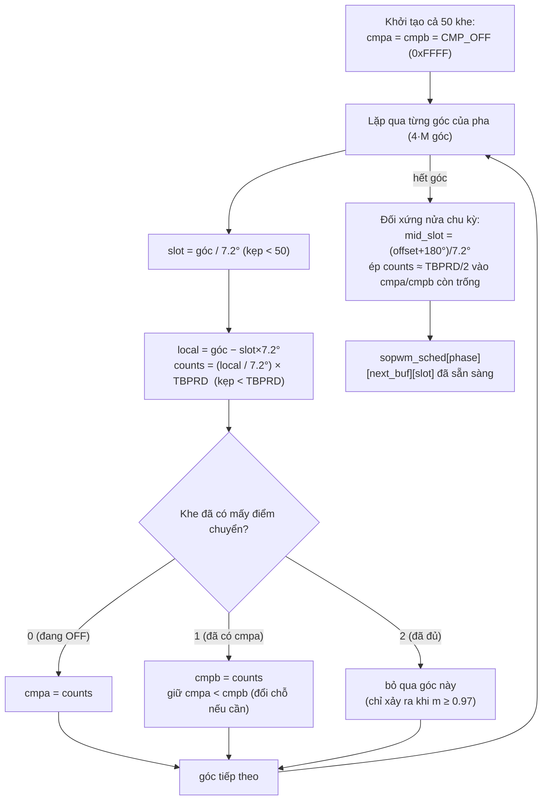
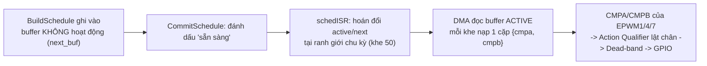

# SOPWM — Luồng dựng lịch chuyển mạch (đã kiểm tra theo code)

Nguồn: `pwm/sopwm/sopwm.c` (`SOPWM_BuildSchedule`, `sopwm_build_phase`), `sopwm.h`, `main.c`.
Ví dụ minh hoạ dùng **N = 7** -> **M = 3** góc cơ sở -> **4·M = 12** góc cả chu kỳ.

> Lưu ý: `GetAngles()` KHÔNG ghi thẳng ra thanh ghi CMP. Góc phải đi qua Build Schedule ->
> bảng `sopwm_sched` (INACTIVE buffer) -> DMA mới tới được CMPA/CMPB của ePWM.

---

## Luồng tổng quát

---

## Chi tiết bước 2 — Mở rộng quarter-wave (M=3 -> 12 góc)

---

## Chi tiết bước 4 + 5 — Gán khe & ghi CMP (sopwm_build_phase)

---

## Bối cảnh — lịch nằm ở đâu và ai đọc

---

### Ghi chú nhanh
- `sopwm_sched` có dạng `[3 pha][2 buffer][50 khe]`, mỗi phần tử = `{cmpa, cmpb}`.
- `CMP_OFF = 0xFFFF` > `TBPRD` nên khe không có điểm chuyển sẽ không bao giờ khớp -> không lật.
- 50 khe = 50 chu kỳ sóng mang (50 kHz) trong 1 chu kỳ cơ bản (1 kHz); mỗi khe = 7.2°.
- `TBPRD` trong build = 2000 (`main.c`), SysConfig đặt period = 1999.
